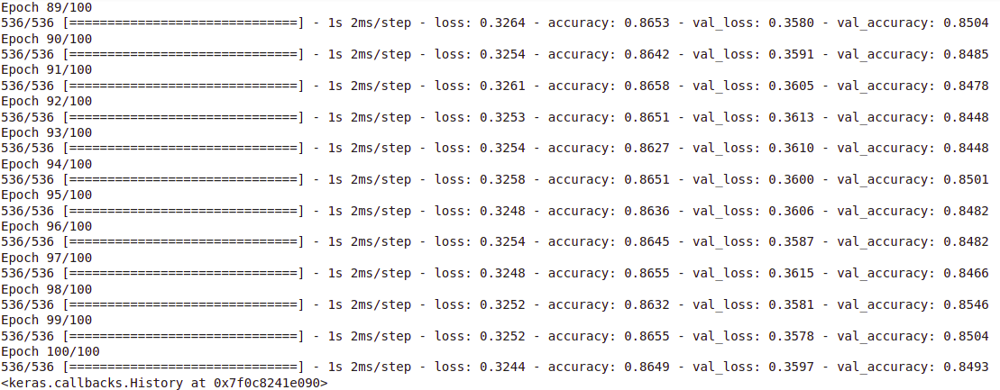

## Project Description

In order to learn about bank's customers we will make use of one of the Deep Learning techniques,i.e.,  ***Artificial Neural Networks (ANN)***. Moreover, we will use popular Python libraries such as ***Tensorflow***, ***Keras*** and Machine Learning techniques such as Adam Optimizer to train the ANN model and predict the churn rates.

## Steps followed

1. Data preprocessing - EDA(Exploratory Data Analysis), Feature Scaling
2. Build ANN architecture 
3. Training ANN on train set
4. Predicting Test set results

